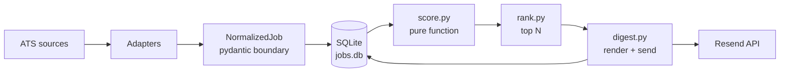

# job-pipeline

A daily-run data pipeline that ingests job postings from ATS APIs, scores them against a configured target profile, and emails a digest of the top 25 unsent matches. Current configuration targets senior data leadership roles in Munich and DACH.

## Why this exists

The senior data leadership market in Munich and DACH (the current target configuration) is fragmented across dozens of careers pages and several ATS platforms. Manual aggregation is slow. This pipeline does it nightly.

The implementation favors patterns that scale beyond a single source. The adapter registry isolates each ATS to one file. Validation happens at the trust boundary, scoring is a pure function, and storage is idempotent by construction. Every choice is documented in [docs/DECISIONS.md](docs/DECISIONS.md).

If the digest surfaces nothing of interest over time, the ingestion or scoring is failing regardless of code quality.

## What it does today

Numbers as of 2026-05-06.

- 6 ATS adapters via a shared registry pattern. Greenhouse (dual URL formats), Lever, Ashby, Personio, Workable, SmartRecruiters
- ~37 companies tracked, ~6200 jobs in SQLite
- Rule-based scoring across 6 dimensions, 0 to 100, with a -25 location penalty for non-EU postings
- Hard filters for below-level roles (junior, intern, working student) and for role=0 jobs (non-data leadership)
- Email digest via Resend, only sends roles not previously notified
- Re-runs are idempotent by construction (hash-based primary key plus INSERT OR IGNORE)
- pytest suite (21 cases) locks scoring behavior so tuning has visible signal

## Pipeline



The dual arrow into SQLite is the `notified_at` writeback after a successful send. Future runs skip already-notified jobs.

## Stack

Python 3.12 managed by uv. pydantic for boundary validation. lxml for Personio XML. requests for HTTP. SQLite for storage with Postgres planned. Jinja2 for the digest template. Resend for transactional email.

No orchestrator yet. Designed to run under cron or GitHub Actions in Day 3.

## Quickstart

Requires Python 3.12 and a Resend API key.

```bash
uv python install 3.12
uv sync

# create .env
cat > .env <<EOF
RESEND_API_KEY=re_your_key
DIGEST_EMAIL=you@example.com
EOF

# scrape every source, idempotent
uv run main.py

# rank and print top 25
uv run rank.py

# render preview without sending
uv run python -m src.digest --dry-run
open output/last_digest.html

# send for real, marks notified_at
uv run python -m src.digest
```

## Repo layout

```
job-pipeline/
├── src/
│   ├── db.py              SQLite schema, upsert, stats
│   ├── score.py           Rule-based scoring (pure function)
│   ├── rank.py            Query DB, score, return top N
│   ├── digest.py          Render template, send via Resend, mark notified
│   └── scrapers/
│       ├── _base.py       NormalizedJob model + shared HTTP helper
│       ├── greenhouse.py  Old + new URL formats
│       ├── lever.py
│       ├── ashby.py
│       └── personio.py    XML parser, subcompany attribution
├── templates/
│   └── digest.html        Jinja2 template
├── main.py                Entry, iterates the SCRAPERS registry
├── rank.py                Entry, prints top 25 to stdout
└── jobs.db                SQLite, gitignored
```

## Documentation

- [docs/ARCHITECTURE.md](docs/ARCHITECTURE.md) for module responsibilities, data flow, schema, and failure modes
- [docs/DECISIONS.md](docs/DECISIONS.md) for the design choices made and the tradeoffs accepted
- [docs/BUILD_LOG.md](docs/BUILD_LOG.md) for the chronological build history

## Honest limitations

Across 4005 jobs scraped, zero matched "Head of Data" or similar director-level postings. Public ATS feeds underrepresent senior leadership roles because those moves happen through executive search and direct outreach. The pipeline is useful as a market scan, not as a complete picture of the leadership market.

Many DACH companies use Workday, SmartRecruiters, or Workable. None of those have adapters yet. Coverage expansion is the next capability gap.

The scorer cannot read intent. A "Solutions Engineer" role with "AI" in the title scores like an AI leadership role even when the JD is sales engineering. Tracked as a known weakness.

## Roadmap

Near-term work, ordered roughly.

1. Per-job JD fetch for Workable and SmartRecruiters (highest-leverage; closes scoring gap on ~1300 listing-only jobs)
2. Workday adapter (requires SCRAPERS registry signature refactor)
3. Variant hunt for SmartRecruiters stub companies (bosch-careers, henkel-group, allianz-careers)
4. Status column CLI to triage postings (`saved`, `watching`, `dismissed`)
5. Custom-page adapters for migrated companies (forto, enpal, tier)
6. Embedding-based semantic scoring once rules hit obvious limits
7. Migration to Supabase Postgres if the storage layer needs a second reader

## License

Not licensed for external use.
